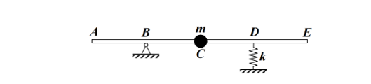
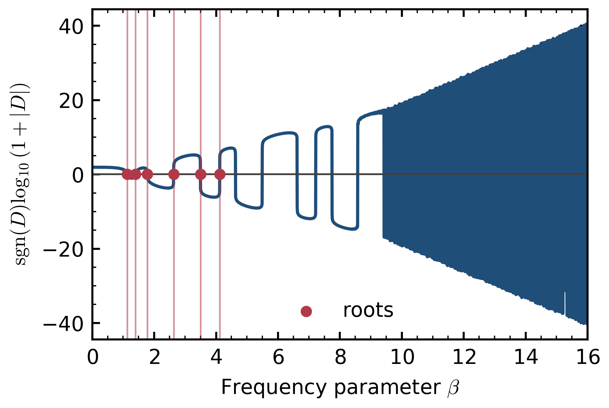
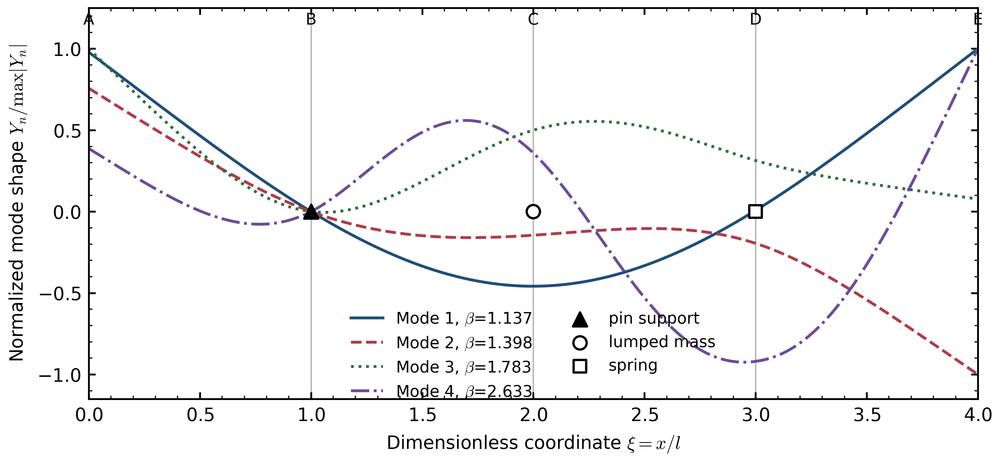
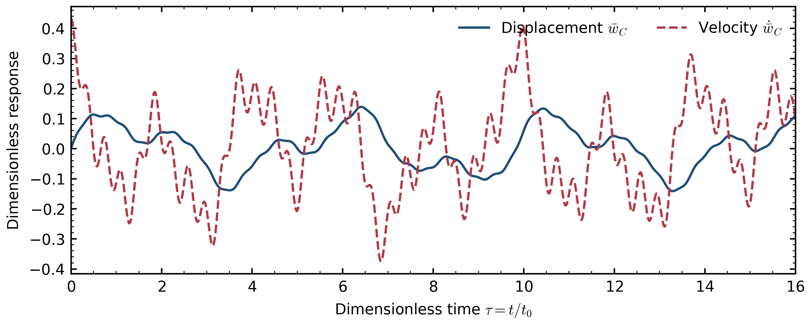
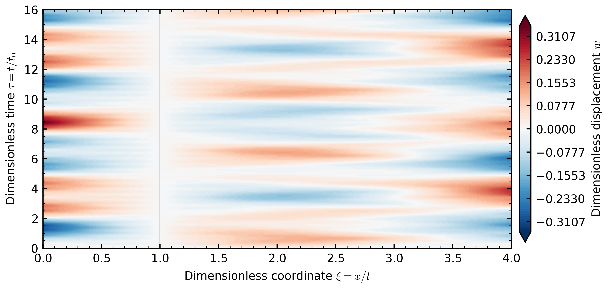
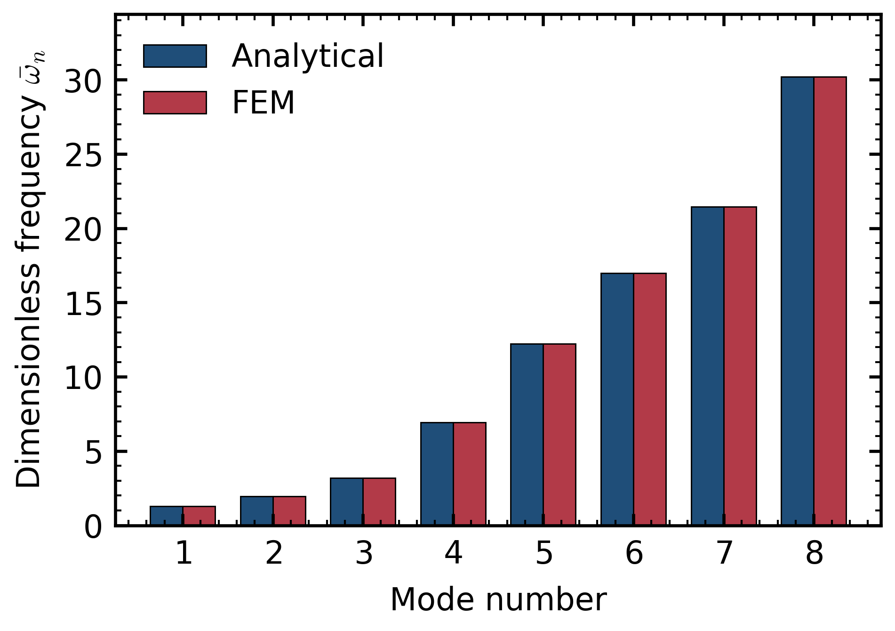
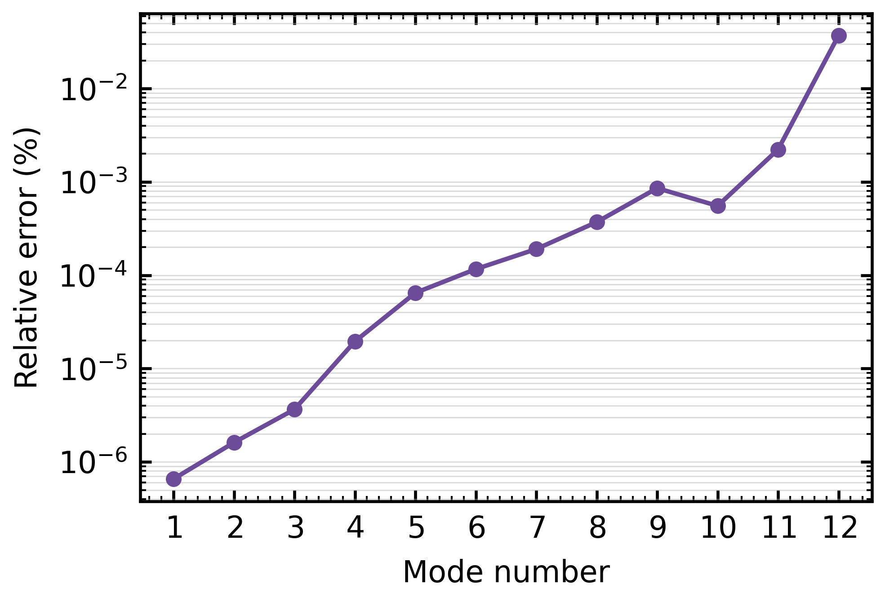
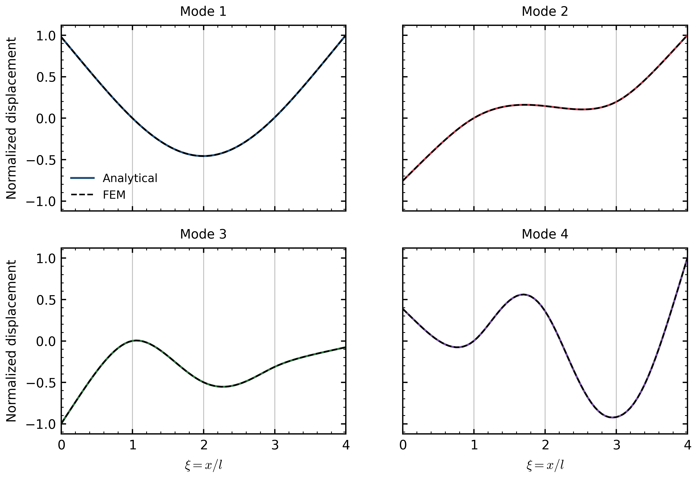
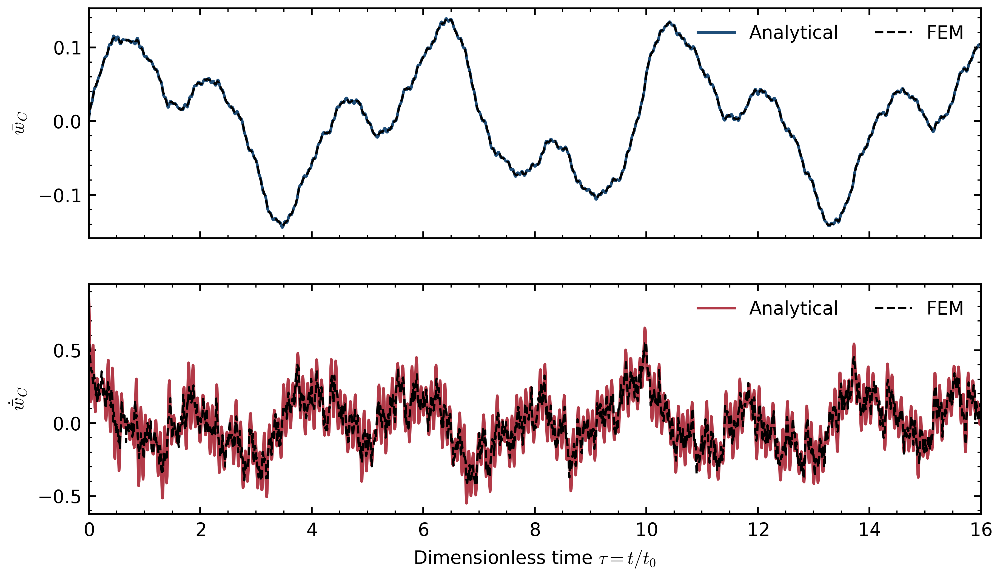

# 结构动力学 Q3 — 弹性支承 Euler-Bernoulli 梁的自由振动

**解析解（传递矩阵法）与有限元验证**

---

## 问题概述

本题研究一均质等截面 Euler-Bernoulli 梁的横向自由振动，梁上包含以下离散元件：

- **铰支座** — 位于 B 点
- **集中质量** $m$ — 附加于 C 点
- **线性弹簧** $k$ — 连接 D 点与地面（竖向）
- **自由端** — 梁两端 A、E 均为自由边界

初始条件：在 $t=0$ 时刻给 C 处的集中质量一个横向初速度 $v_0$。



梁总长 $L = 4l$，各跨等长：$AB = BC = CD = DE = l$。

> **核心问题**：局部离散元件（支座、质量、弹簧）如何改变连续梁的固有频率、振型以及动力学响应？

---

## 分析方法

采用两种独立的方法并交叉验证：

### 解析法：传递矩阵法

1. **控制方程**：Euler-Bernoulli 梁理论，分离变量法
2. **无量纲化**：坐标 $\xi = x/l$，频率参数 $\beta = \lambda l$
3. **跳跃条件**：C 点剪力跳跃（集中质量惯性力）、D 点剪力跳跃（弹簧反力）
4. **状态向量**：$\mathbf{z}(\xi) = [Y, Y', Y'', Y''']^\mathrm{T}$，统一描述连续段与离散元件
5. **特征方程**：$\det\mathbf{A}(\beta) = 0$ → 特征值 $\beta_n$ → 固有频率 $\omega_n = \frac{\beta_n^2}{l^2}\sqrt{\frac{EJ}{\rho S}}$

### 数值法：有限元法

- **单元**：2 节点 Euler-Bernoulli Hermite 梁单元（每节点 2 自由度：$w$, $\theta$）
- **网格**：80 单元，81 节点
- **约束处理**：B 点铰支座通过自由度的束实现，C 点质量叠加到质量矩阵，D 点弹簧叠加到刚度矩阵
- **特征值问题**：$\mathbf{K}\boldsymbol{\Phi}_n = \omega_n^2 \mathbf{M}\boldsymbol{\Phi}_n$
- **响应求解**：模态叠加法，取前 24 阶模态

### 计算参数

| 参数 | 符号 | 取值 |
|------|------|------|
| 质量比 | $\alpha = m / (\rho S l)$ | 0.5 |
| 弹簧刚度 | $\kappa = k l^3 / (EJ)$ | 20.0 |

---

## 结果

### 固有频率

前 11 阶频率解析解与 FEM 高度吻合：

| 阶数 | 解析解 $\bar{\omega}_n$ | 有限元 $\bar{\omega}_n$ | 相对误差 |
|:----:|:--------------------------:|:--------------------:|:---------:|
| 1 | 1.29291120 | 1.29291121 | $6.6\times10^{-7}\%$ |
| 2 | 1.95408261 | 1.95408264 | $1.6\times10^{-6}\%$ |
| 3 | 3.17948221 | 3.17948233 | $3.7\times10^{-6}\%$ |
| 4 | 6.93522035 | 6.93522170 | $2.0\times10^{-5}\%$ |
| ... | ... | ... | ... |
| 12 | 73.64864210 | 73.67590498 | $3.7\times10^{-2}\%$ |

> 第 12 阶开始 FEM 空间离散误差显著增大，标志着该网格的频率上限。

### 振型

前四阶振型解析解与 FEM 近乎完全重合，$L_2$ 相对误差在 $10^{-9}$ 至 $10^{-8}$ 量级。

### 动力学响应

- **C 点位移**：RMS 误差 $1.27\times10^{-3}$
- **C 点速度**：RMS 误差 $1.01\times10^{-1}$（对高阶截断更敏感）
- 整个时间窗口内无相位漂移，验证了频率一致性。

---

## 可视化图览

| 图 | 说明 |
|----|------|
|  | 特征行列式扫描，定位频率参数 $\beta$ |
|  | 解析振型（第 1–4 阶） |
|  | C 点位移/速度/加速度时程 |
|  | 全场 $w(x,t)$ 时空云图 |
|  | 频率柱状图对比 |
|  | 频率相对误差 |
|  | 解析与 FEM 振型叠加对比 |
|  | C 点响应时程对比 |

---

## 项目结构

```text
.
├── assets/                          # 图片与可视化结果
│   ├── image-20260601616038017.png  # 结构模型示意图
│   ├── q3_fem/                      # FEM 结果图
│   ├── q3_visualization/            # 解析解结果图
│   └── q3_comparison/               # 解析-FEM 对比图
├── outputs/                         # FEM 求解器输出的 CSV 数据
│   ├── fem/                         # FEM 求解结果
│   └── comparison/                  # 对比数据
├── paper/                           # 论文草稿（LaTeX）
│   ├── beam_dynamics_paper.tex
│   └── beam_dynamics_paper.pdf
├── slides/                          # Beamer 幻灯片
│   ├── q3_beamer_slides.tex/.pdf
│   └── slides_new/                  # 修订版（24 页）
│       ├── q3_slides.tex/.pdf
│       └── q3_slides_script.md      # 讲稿
├── fem_q3_solver.f90                # Fortran 90 FEM 求解器
├── fem_q3_solver.exe                # 编译后的可执行文件
├── postprocess_fem_q3.py            # FEM 后处理
├── compare_analytic_fem_q3.py       # 解析-FEM 对比与误差分析
├── visualize_q3.py                  # 解析解可视化
├── 结构动力学q3.md                    # 完整解析推导（含题目）
├── 结构动力学q3_推导检查报告.md       # 推导验证报告
├── 结构动力学q3_FEM计算报告.md        # FEM 计算报告
├── 结构动力学q3_解析解-FEM对比报告.md  # 解析-FEM 对比报告
├── 结构动力学q3_可视化计算报告.md      # 可视化报告
├── 结构动力学q3_汇报PPT逐页内容.md    # 汇报讲稿
└── AGENTS.md                        # 开发协作记录
```

---

## 复现步骤

### 环境依赖

- **Fortran**：任意现代 Fortran 编译器（已用 MSYS2 `gfortran` 13+ 测试）
- **Python**：3.10+
  - `numpy`, `scipy`
  - `matplotlib` + `SciencePlots`
  - `pandas`
- **LaTeX**（编译幻灯片）：`xelatex` + `ctexbeamer`, `newtxmath`

### 运行

```bash
# 1. 编译并运行 FEM 求解器
gfortran fem_q3_solver.f90 -o fem_q3_solver
./fem_q3_solver

# 2. FEM 后处理
python postprocess_fem_q3.py

# 3. 生成对比图
python compare_analytic_fem_q3.py

# 4. 编译幻灯片
cd slides_new && xelatex q3_slides.tex
```

---

## 许可

本项目以学术参考与可复现研究为目的开源。
