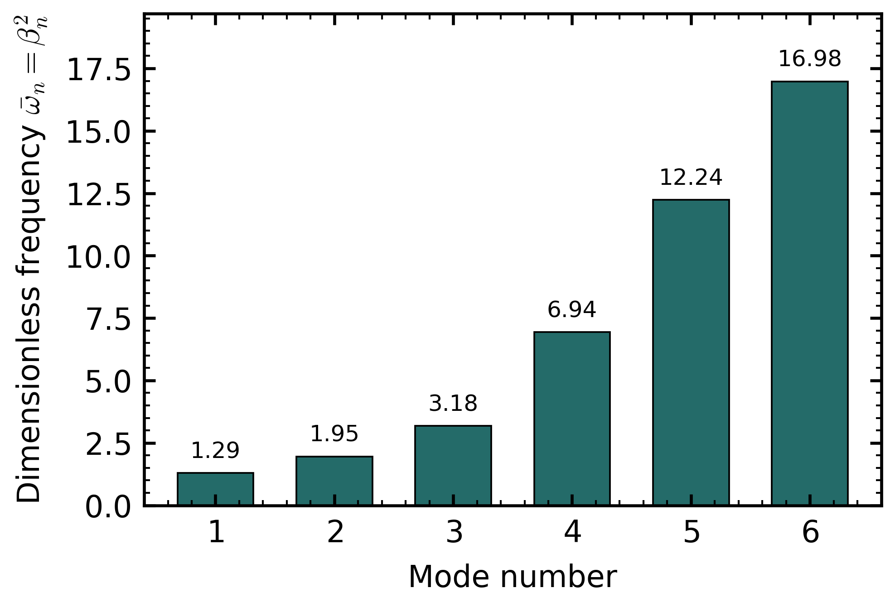

# 结构动力学 Q3 可视化计算报告

## 1. 计算模型

本报告对解析解进行无量纲数值可视化。采用的无量纲参数为

$$
\alpha=\frac{m}{\rho Sl},\qquad \kappa=\frac{kl^3}{EJ}
$$

代表算例参数如下：

- 集中质量参数：$\alpha=0.5$
- 弹簧刚度参数：$\kappa=20$
- 初速度尺度：$\bar v_0=1$
- 响应叠加模态数：6

无量纲固有频率定义为

$$
\bar{\omega}_n=\omega_n l^2\sqrt{\frac{\rho S}{EJ}}=\beta_n^2
$$

实际圆频率可由

$$
\omega_n=\frac{\bar{\omega}_n}{l^2}\sqrt{\frac{EJ}{\rho S}}
$$

恢复。

## 2. 特征根与固有频率

| Mode | $\beta_n$ | $\bar{\omega}_n=\beta_n^2$ | $\bar M_n$ | $Y_n(2)$ | $Y_n(3)$ |
|---:|---:|---:|---:|---:|---:|
| 1 | 1.137063 | 1.292911 | 0.889666 | -0.443889 | 0.006440 |
| 2 | 1.397885 | 1.954083 | 0.812689 | -0.170727 | -0.229452 |
| 3 | 1.783110 | 3.179482 | 0.423642 | 0.380378 | 0.239049 |
| 4 | 2.633481 | 6.935220 | 1.439813 | 0.427088 | -1.092794 |
| 5 | 3.498073 | 12.236517 | 0.221072 | 0.025866 | -0.168320 |
| 6 | 4.120885 | 16.981693 | 0.030986 | -0.064788 | 0.023157 |

特征方程扫描与根的位置如下图所示。

前几阶无量纲频率谱如下。

## 3. 振型函数

下图给出前四阶振型，所有振型均按各自最大绝对位移归一化。图中 $B$ 为外部简单支承点，$C$ 为集中质量位置，$D$ 为弹簧位置。

## 4. 动力响应

响应采用如下无量纲时间

$$
\tau=\frac{t}{t_0},\qquad t_0=l^2\sqrt{\frac{\rho S}{EJ}}
$$

并取初位移为零，初始动量只由 $C$ 点集中质量的速度贡献。$C$ 点响应如下。

全梁时空响应云图如下。

## 5. 输出文件

- characteristic: `../assets/q3_visualization/q3_characteristic_roots.png`, `../assets/q3_visualization/q3_characteristic_roots.pdf`
- spectrum: `../assets/q3_visualization/q3_frequency_spectrum.png`, `../assets/q3_visualization/q3_frequency_spectrum.pdf`
- modes: `../assets/q3_visualization/q3_mode_shapes.png`, `../assets/q3_visualization/q3_mode_shapes.pdf`
- c_response: `../assets/q3_visualization/q3_c_point_response.png`, `../assets/q3_visualization/q3_c_point_response.pdf`
- spacetime: `../assets/q3_visualization/q3_spacetime_response.png`, `../assets/q3_visualization/q3_spacetime_response.pdf`

## 6. 说明

由于题目没有给出 $m$、$k$、$EJ$、$\rho S$ 和 $l$ 的具体数值，本报告采用无量纲代表算例展示解析解的计算流程。若需要换成具体工程参数，只需修改 Python 脚本中的 `BeamParams(alpha=..., kappa=...)`，并通过频率恢复公式换算为实际单位。
